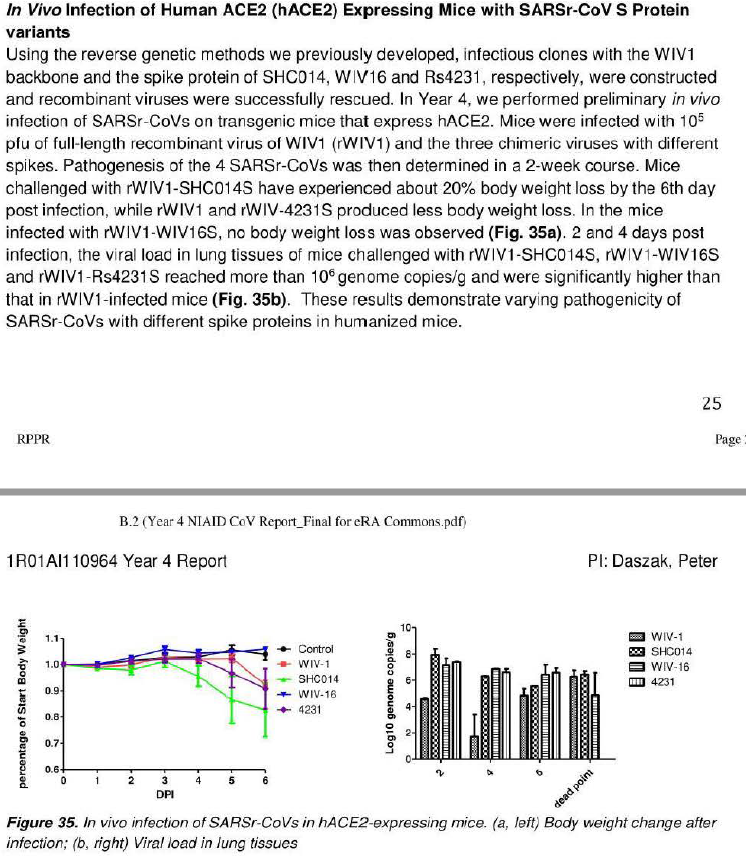

## Timeline

### **2018**

**Project DEFUSE:** was a grant proposal to modify and study novel bat coronaviruses. The proposal was submitted to the DARPA PREEMPT call, and was rejected under the classification of Gain of Function research.

- [original document](https://s3.documentcloud.org/documents/21066966/defuse-proposal.pdf)

This project was headed by Peter Daszak, from the EcoHealth Alliance, and was funded by the NIAID since 2016 despite DARPA's rejection.

- 

#### **2020**

**February**

- [Zhou Yusen filed a patent for a Covid-19 vaccine on February 24, 2020](https://www.dailymail.co.uk/news/article-12205705/Chinese-military-expert-filed-patent-Covid-vaccine-died-mysterious-circumstances.html).

**March**

- [TheProximal Origin of SARS-CoV-2](https://www.nature.com/articles/s41591-020-0820-9?utm_medium=affiliate&utm_source=commission_junction&utm_campaign=CONR_PF018_ECOM_GL_PHSS_ALWYS_DEEPLINK&utm_content=textlink&utm_term=PID100093539&CJEVENT=09662aa4201d11ee83a0cf610a82b821)
  - "Our analyses clearly show that SARS-CoV-2 is not a laboratory construct or a purposefully manipulated virus."

**May**

- [Zhou Yusen died in mysterious circumstances in May 2020](https://www.dailymail.co.uk/news/article-12205705/Chinese-military-expert-filed-patent-Covid-vaccine-died-mysterious-circumstances.html), aged 54. Zhou worked for the People's Liberation Army and was collaborating with Wuhan scientists at the time of the outbreak. US investigators are said to have been told 'Zhou fell from the roof of the Institute', although this has not been confirmed.

#### **2021**

**January**

- Werriam Webster changed the definition of _Vaccine_

  - [Jan 11, 2021](https://web.archive.org/web/20210111203208/https://www.merriam-webster.com/dictionary/vaccine)
  - [Jan 26, 2021](https://web.archive.org/web/20210126065143/https://www.merriam-webster.com/dictionary/vaccine)

- [Loss of Furin Cleavage Site Attenuate SARS-CoV-2 Pathogenesis](https://www.ncbi.nlm.nih.gov/pmc/articles/PMC8175039/)

**December**

- [Canadian Covid Care Alliance: The Pfizer Inoculations for COVID-19, More Harm than Good](https://www.canadiancovidcarealliance.org/wp-content/uploads/2021/12/The-COVID-19-Inoculations-More-Harm-Than-Good-REV-Dec-16-2021.pdf)

#### **2022**

**February**

- [Lawrence Sellin: The Laboratory Origin of COVID-19](https://lawrencesellin.substack.com/p/the-laboratory-origin-of-covid-19)

**October**

- [Senate Committee on Health Education, Labor and Pensions: An Analysis of the Origins of the COVID-19 Pandemic](https://www.help.senate.gov/imo/media/doc/report_an_analysis_of_the_origins_of_covid-19_102722.pdf)

#### **2023**

**January**

- [AHA Circulation Journal: Circulating Spike Protein Detected in Post–COVID-19 mRNA Vaccine Myocarditis](https://www.ahajournals.org/doi/10.1161/CIRCULATIONAHA.122.061025)
  - "We discovered that individuals who developed postvaccine myocarditis uniquely exhibit elevated levels of free spike protein in circulation, unbound by anti-spike antibodies, which appear to correlate with cardiac troponin T levels and innate immune activation with cytokine release.""

**February**

- [Bivalent Covid-19 Vaccines — A Cautionary Tale](https://www.nejm.org/doi/full/10.1056/NEJMp2215780?query=TOC&cid=NEJM%20eToc,%20February%209,%202023%20DM1983578_NEJM_Non_Subscriber&bid=1404083904)

**May**

- [U.S. Senate Report: A Political Chronology of the SARS-CoV-2 Outbreak](https://www.rubio.senate.gov/wp-content/uploads/_cache/files/4f6bb786-504e-443d-8904-974dafc1cd0e/CD3BC3317D197A25E9FF01EBFB869357.rubio-covid-origins-report-final.pdf)
  - Vaccine could not have been developed in claimed timeframe, must have began Nov '19 or earlier

**June**

- [Dr. Peter Hotez's Funding Linked to Controversial Chinese Military Scientists at Wuhan Lab](https://www.kanekoa.news/p/exclusive-dr-peter-hotezs-funding)
  - Funded by Dr. Fauci and Dr. Hotez's R01AI098775 grant, Dr. Shibo Jiang and Dr. Lanying Du collaborated with scientists from the People's Liberation Army and the Wuhan Institute of Virology.

**July**

- [Investigating the Proximal Origin of a Cover-Up](https://oversight.house.gov/wp-content/uploads/2023/07/Garry-Testimony.pdf)

**August**

- [National Review: The Covid Cover-Up](https://www.nationalreview.com/2023/08/the-covid-cover-up/)
